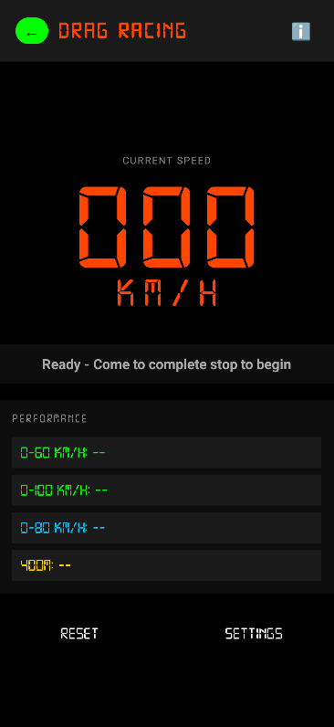

# 🚗 Speedometer App

A GPS-based speedometer and drag racing timer for Android with real-time tracking and performance analysis.

## Features

### 📊 GPS Speedometer (Screen 1)
- **Real-time speed display** in km/h with zero-padded digital format (000)
- **Smooth animated speed transitions** (60fps interpolation)
- **Trip tracking features**:
  - Average speed calculation (distance/time)
  - Total trip distance measurement
  - 3-second long-press to reset trip data
- **GPS monitoring**:
  - Accuracy display (±X.X meters)
  - Signal strength indicator (Excellent/Good/Fair/Poor)
- **Maximum speed tracking** with 3-second long-press reset
- **Info dialog** (ℹ️ button) - Explains GPS accuracy, delays, and usage tips
- **Portrait-only mode** for driving safety
- **Screen stays awake** during use
- Responsive design with digital7 font for speedometer aesthetic

### 🏁 Drag Racing Mode (Screen 2)
- **High-precision GPS** (100ms updates, 10x faster than speedometer)
- **Auto-start timer** from 0 km/h (no manual button needed)
- **Performance measurements**:
  - **0-60 km/h** time
  - **0-100 km/h** time
  - **Custom speed target** (default: 80 km/h, configurable)
  - **Custom distance** (default: 400m, configurable)
- **Precision tracking**:
  - Speed: 1 decimal place (0.0 km/h)
  - Time: 2 decimal places (0.00 seconds)
  - Distance: 2 decimal places (0.00 meters)
- **Best time tracking** with ⭐ indicator (persistent across sessions)
- Current time vs. best time comparison
- **Color-coded status**:
  - 🔴 Red: Error (GPS disabled/permission denied)
  - 🟠 Orange: Searching for GPS signal
  - 🟡 Yellow: Ready to start
  - 🟢 Green: Timer running
- **Info dialog** (ℹ️ button) - Racing mode tips and safety warnings
- Configurable targets via settings dialog
- **3-second long-press reset** to prevent accidental resets
- Distance tracking with real-time display
- **Screen stays awake** during racing

## Screenshots




## Requirements

- Android 9.0 (API 28) or higher
- GPS/Location services enabled
- Location permission granted

## Installation

### From Release
1. Download the latest APK from [Releases](../../releases)
2. Enable "Install from Unknown Sources" in your Android settings
3. Open the APK file and install

### Build from Source
1. Clone this repository
2. Open in Android Studio
3. Sync Gradle files
4. Build and run on your device

```bash
git clone https://github.com/gwenz2/gps-based-speedometer.git
cd gps-based-speedometer
./gradlew assembleDebug
```

## Usage

### GPS Speedometer Mode
1. **Launch the app** - Grant location permissions when prompted
2. Wait for GPS signal (go outside for best results - may take 30-60s)
3. View your current speed with smooth animations (zero-padded format: 000)
4. **Monitor GPS quality** - Check accuracy and signal strength below speed
5. **Track your trip** - Average speed and distance update automatically
6. **Reset max speed** - Hold the max speed text for 3 seconds
7. **Reset trip data** - Hold average speed or distance for 3 seconds
8. **Learn more** - Tap ℹ️ button for GPS info and tips
9. **Switch modes** - Tap the "→" button for drag racing mode

### Drag Racing Mode
1. Tap "→" button from the speedometer screen
2. **Check status color**:
   - Yellow = Ready to start
   - Green = Timer running
   - Red/Orange = GPS issue
3. **Come to complete stop** (0 km/h) - timer is ready (Yellow status)
4. **Accelerate** - Timer starts automatically when speed > 1 km/h (Green status)
5. Watch your times populate as you hit each milestone
6. **View best times** - Your personal records show with ⭐ symbol
7. **Customize targets** - Tap "SETTINGS" to change speed/distance goals
8. **Learn more** - Tap ℹ️ button for racing tips and safety info
9. **Reset for next run** - Hold "RESET" button for 3 seconds
10. **Go back** - Tap "←" button to return to speedometer

## Permissions

- **ACCESS_FINE_LOCATION** - Required for GPS speed measurement
- **ACCESS_COARSE_LOCATION** - Required for location services
- **WAKE_LOCK** - Keeps screen on during use (no timeout)

## Technology Stack

- **Language**: Kotlin
- **Min SDK**: 28 (Android 9.0)
- **Target SDK**: 36
- **Version**: 1.4 (versionCode 4)
- **Architecture**: Single Activity per screen
- **Location**: Android LocationManager API (1s updates for speedometer, 100ms for drag mode)
- **UI**: Material Design 3 with digital7 custom font
- **Storage**: SharedPreferences for settings and best times

## Development

### Project Structure
```
app/
├── src/main/
│   ├── java/com/gwenz/speedometer/
│   │   ├── MainActivity.kt           # GPS Speedometer
│   │   └── DragModeActivity.kt       # Drag Racing Timer
│   ├── res/
│   │   ├── layout/
│   │   │   ├── activity_main.xml     # Speedometer UI
│   │   │   └── activity_drag_mode.xml # Drag Mode UI
│   │   ├── mipmap-*/                 # App icons
│   │   └── values/
│   └── AndroidManifest.xml
└── build.gradle.kts
```

### Key Features Implementation
- **Smooth Speed Animation**: 60fps interpolation using Handler with 16ms delay and 0.3 factor
- **Auto-start Timer**: Detects movement from 0 km/h (>1 km/h threshold)
- **Trip Tracking**: 
  - Distance accumulation with GPS drift filtering (>1 km/h, <100m jumps)
  - Average speed calculation: totalDistance / totalTime
  - Real-time updates with 1-second intervals
- **GPS Monitoring**:
  - Accuracy from Location.hasAccuracy() and Location.getAccuracy()
  - Signal quality estimation based on accuracy thresholds
  - Satellite count detection from location extras
- **Distance Tracking**: Uses Location.distanceTo() for accurate measurements
- **Persistent Settings**: SharedPreferences for custom targets and best times
- **Long Press Reset**: 3-second hold with visual feedback and haptic response
- **Best Time Management**: Automatically saves and compares personal records
- **Dynamic Status Colors**: Color.parseColor() for real-time status indication
- **Info Dialogs**: AlertDialog with comprehensive usage instructions and disclaimers
- **Screen Wake Lock**: Keeps display on using keepScreenOn attribute
- **Digital Font**: Custom digital7.ttf for authentic speedometer look
- **Responsive UI**: Fixed headers with organized panel layout

## License

This project is licensed under the MIT License - see the [LICENSE](LICENSE) file for details.

## Disclaimer

⚠️ **Safety First**: This app is intended for closed course/track use only. Always obey traffic laws and never use your phone while driving on public roads. The developer is not responsible for any accidents or violations.

## Author

**Gwen** (@gwenz2)

## Repository

[https://github.com/gwenz2/gps-based-speedometer](https://github.com/gwenz2/gps-based-speedometer)

---

Made with ❤️ for car enthusiasts and track day warriors
